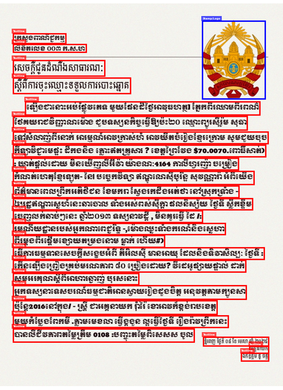
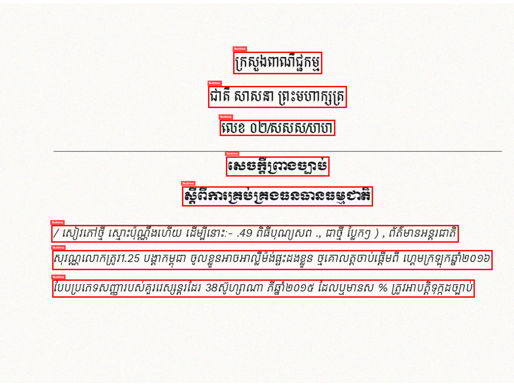
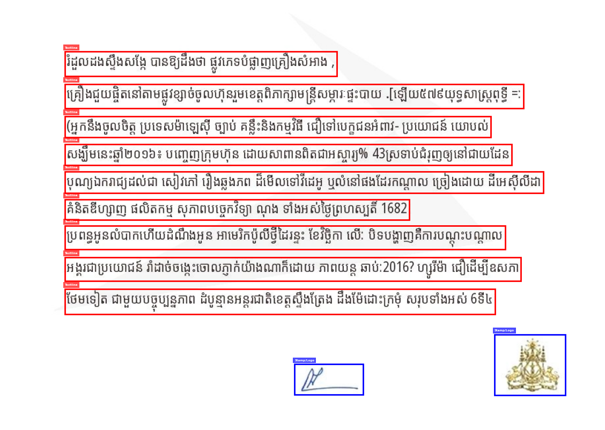
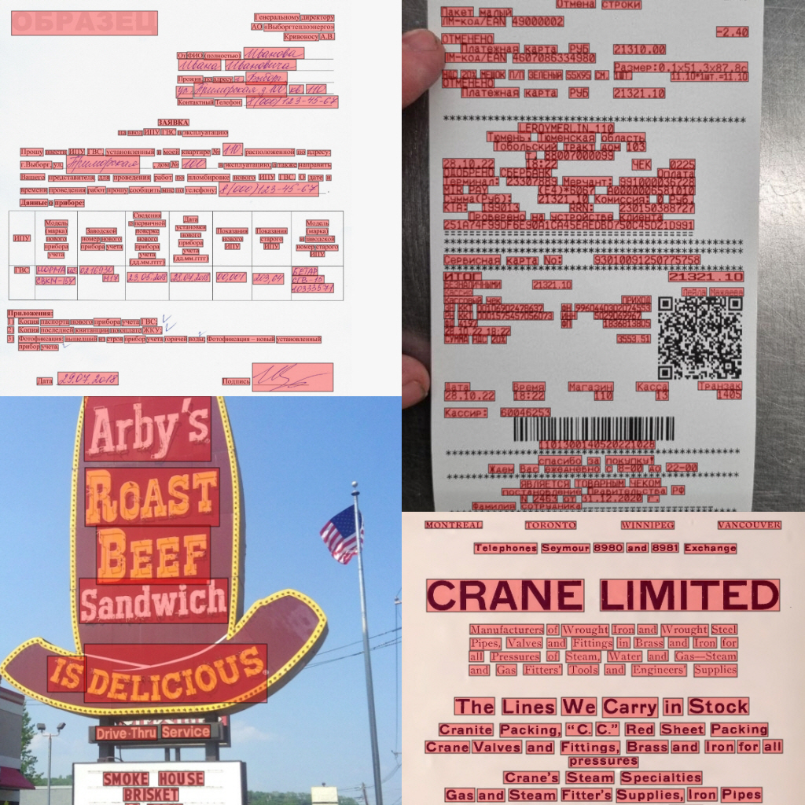
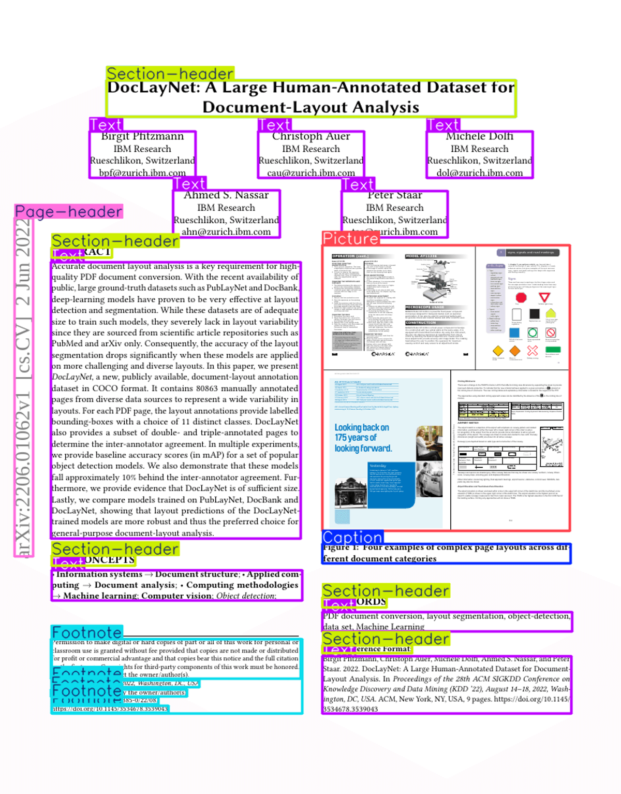
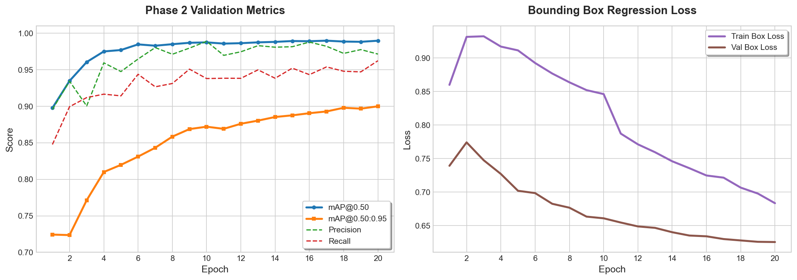
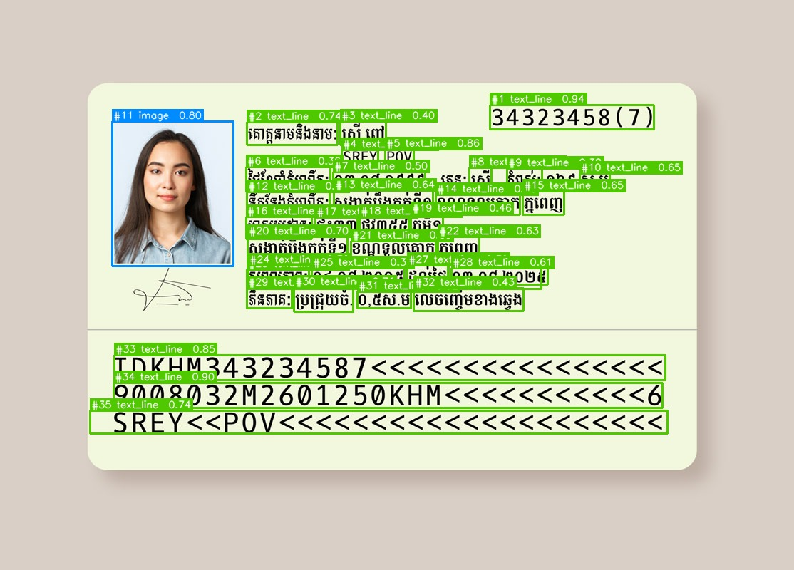
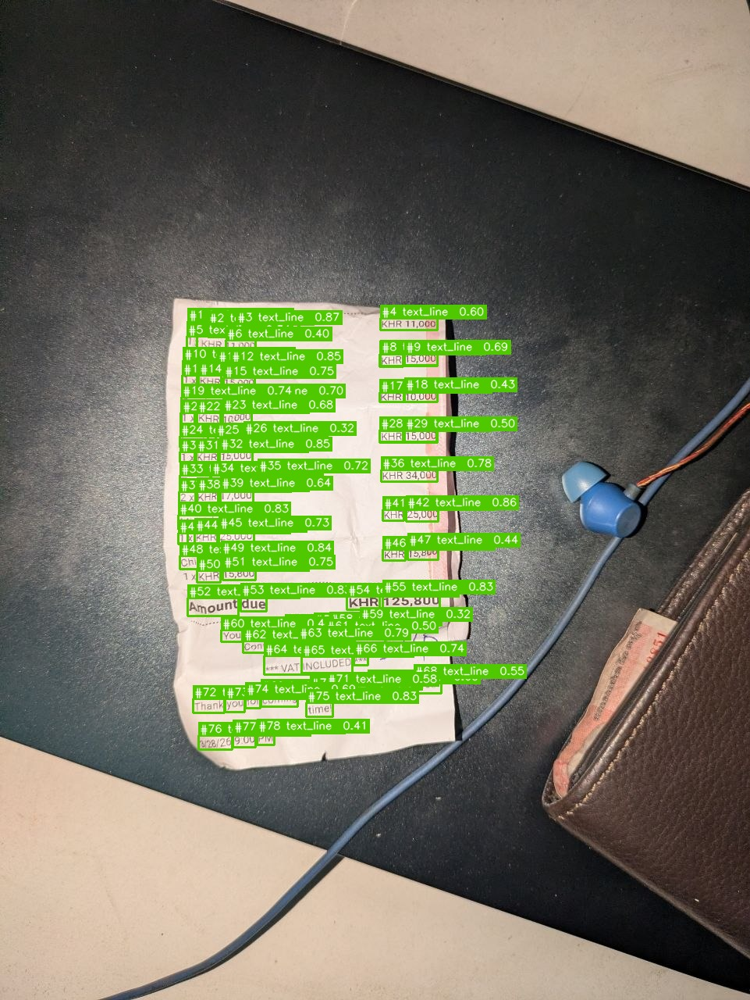

# Multilingual Textline and Graphical Element Detection via End-to-End YOLO26

## Abstract
This project presents a robust, dual-class object detection pipeline designed to localize dense multilingual textlines (Latin, and Non-Latin scripts) alongside graphical elements (logos, profile pictures, and charts). The methodology addresses the inherent challenges of domain shift between synthetic documents, noisy scanned layouts, and natural scene text. Furthermore, we propose a bootstrap pseudo-labeling pipeline to mitigate False Negative Poisoning (Missing Label Poisoning) caused by partially annotated external datasets. The final model is trained on the newly released YOLO26 architecture, leveraging its native NMS-free inference and MuSGD optimizer to achieve high-precision detection in computationally constrained environments.

---

## 1. Introduction & Objectives
Traditional Optical Character Recognition (OCR) systems struggle with complex document layouts and noisy scene text. An essential preprocessing step is accurate textline localization. 

The primary objective of this project is to develop a language-agnostic detection model capable of parsing highly variable document structures. The model is trained to classify two distinct targets:
*   **Class 0 (`textline`):** Tightly packed lines of text across various scripts.
*   **Class 1 (`image`):** Embedded graphical elements, such as logos, charts, and ID card profile photos.

## 2. Dataset Methodology
To ensure model generalization, we constructed a large-scale hybrid dataset containing approximately 30,000 images, merging procedural synthetic data with real-world open-source datasets.

### 2.1 Procedural Synthetic Document Generation
To capture the specific structural constraints inherent to formalized records and bureaucratic paperwork, we engineered a procedural data generation pipeline focused exclusively on synthetic document synthesis. The resulting dataset is publicly available on the Hugging Face Hub: [Darayut/khmer-textline-dataset](https://huggingface.co/datasets/Darayut/khmer-textline-dataset).

The synthesis engine introduces high entropy across several parameters to ensure model robustness:
*   **Typographical and Dimensional Variance:** Integrated diverse custom font files to accurately render complex Khmer ligatures, varying font weights, and spacing. Furthermore, the pipeline dynamically renders documents across a wide spectrum of image dimensions and aspect ratios.
*   **Spatial and Layout Randomization:** Programmatically generated diverse structural layouts to simulate real-world variance, ranging from dense multi-column layouts to sparse, centralized text configurations.
*   **Asset Injection:** Randomly embedded non-textual graphical objects—specifically institutional logos, official stamps, and signatures—onto varied background textures. The generation script automatically extracts mathematically precise ground-truth bounding box coordinates for both the `textline` and `image` classes.

<div align="center">
  
  
  
  <p><em>Figure 1: Procedurally generated synthetic Khmer documents. Note the variance in paragraph density, structural layout, and the injection of stamps, logos, and signatures.</em></p>
</div>

### 2.2 External Dataset Integration
To improve robustness against real-world artifacts (e.g., motion blur, sensor noise, varying illumination), the synthetic data was augmented with streaming datasets via the Hugging Face Hub:
*   **DonkeySmall:** Natural scene text captured in diverse outdoor environments. This dataset introduces extreme variance in background noise, typography, and perspective distortion, preventing the model from overfitting to clean, flat document scans.
*   **IBM DocLayNet:** Dense, complex document layouts (such as financial reports, patents, and scientific papers). This dataset provides high-fidelity, human-annotated ground truth for complex structural layouts, including critical `image` class entities like charts and pictures.

<div align="center">


<p><em>Figure 2: Examples of external integration domains. Left: Natural scene text representing extreme environmental variance and distortion. Right: Structured document layouts illustrating dense topological elements and multi-column formatting.</em></p>
</div>

---

## 3. Model Architecture: YOLO26
This project utilizes **YOLO26s** (released early 2026 by Ultralytics), which introduces several architectural paradigm shifts that are particularly advantageous for dense text detection.

*   **End-to-End NMS-Free Inference:** Previous YOLO iterations relied heavily on Non-Maximum Suppression (NMS), which frequently suppresses overlapping or tightly stacked textlines. YOLO26 outputs predictions directly without NMS, drastically reducing latency while preserving recall in dense regions.
*   **Small-Target-Aware Label Assignment (STAL):** Enhances the model's sensitivity to extremely small bounding boxes, a critical requirement for localizing distant scene text or micro-printing on ID cards.
*   **MuSGD Optimizer:** YOLO26 introduces MuSGD, a hybrid optimizer inspired by Kimi's Muon optimizer. It blends the generalization capabilities of SGD with momentum/curvature behaviors, allowing for stable convergence during multi-domain fine-tuning.

## 4. Training Strategy

To effectively bridge the domain gap between natural scene text, standardized document layouts, and our targeted synthetic Khmer documents, a two-phase sequential training paradigm was employed. This approach establishes robust, generalized feature representations before specializing the model on procedural layouts, strictly controlling learning rates to prevent catastrophic forgetting.

### 4.1 Phase 1: Domain-Specific Foundation Pretraining
The initial phase focused on establishing the base dual-class feature extraction head (`textline` and `image`). The model was initialized with official `yolo26s.pt` COCO weights and trained exclusively on the **Mega Dataset** (comprising DonkeySmall scene text and PubLayNet complex document layouts). Training utilized an initial learning rate of `0.001` over 30 epochs. This allowed the model to construct generalized representations of text topology and graphical elements across highly diverse, real-world environments without being biased by synthetic procedural generation.

### 4.2 Phase 2: Synthetic Integration and Fine-Tuning
In the second phase, the model was fine-tuned on the **Ultimate Dataset**, which concatenated the Phase 1 data with the newly generated, perfectly annotated synthetic Khmer documents. To prevent the new synthetic gradients from overwriting the established representations (a phenomenon known as "optimizer shock"), the learning rate was aggressively reduced by a factor of 20 (from `1e-3` to `5e-05`). The adaptive AdamW optimizer was utilized to dynamically scale learning rates per-parameter, ensuring stable convergence and maximum retention of previously learned domains.

### 4.3 Hyperparameter Configuration
The training regimens for both phases were executed using the parameters detailed in Table 1. Spatial augmentations (e.g., rotation, shear, perspective) were intentionally disabled (`0.0`) to preserve the tight bounding-box integrity required for dense textline localization, while photometric and mosaic augmentations were heavily utilized to simulate scan degradation and scale variance.

*Table 1: YOLO26s Training and Fine-Tuning Hyperparameters*

| Parameter | Phase 1 (Foundation Pretraining) | Phase 2 (Synthetic Fine-Tuning) |
| :--- | :--- | :--- |
| **Base Weights** | `yolo26s.pt` | `best.pt` (from Phase 1) |
| **Dataset** | PubLayNet + DonkeySmall (`mega`) | Phase 1 Data + Synthetic (`ultimate`) |
| **Epochs** | 30 | 20 |
| **Optimizer** | `MuSGB` | `AdamW` |
| **Initial Learning Rate (`lr0`)** | `1.0e-03` | `5.0e-05` |
| **Final LR Fraction (`lrf`)** | `0.01` | `0.01` |
| **Batch Size** | 16 | 16 |
| **Image Size (`imgsz`)** | 640 | 640 |
| **Mosaic Augmentation** | 1.0 | 1.0 |
| **Photometric Augmentation** | HSV (h: 0.015, s: 0.7, v: 0.4) | HSV (h: 0.015, s: 0.7, v: 0.4) |
| **Spatial Augmentation** | Disabled (0.0) | Disabled (0.0) |

---

## 5. Performance Metrics and Evaluation

## 5. Results and Evaluation

The final model was evaluated on the validation split of the Ultimate Dataset following the Phase 2 fine-tuning regimen. The rigorous two-phase training strategy, coupled with conservative learning rate modulation, successfully prevented catastrophic forgetting and yielded highly stable convergence.

### 5.1 Quantitative Performance Metrics
By Epoch 20 of Phase 2, the model demonstrated exceptional localization precision and recall across both the `textline` and `image` classes. The bounding box regression loss (`val/box_loss`) exhibited a smooth, monotonic decrease without any indications of overfitting, validating the efficacy of the photometric augmentations and adaptive AdamW optimization. 

**Final Validation Metrics (Epoch 20):**
*   **Precision (P):** 0.9715
*   **Recall (R):** 0.9624
*   **mAP@0.50:** **0.9898**
*   **mAP@0.50:0.95:** **0.9000**

The remarkably high mAP@0.50:0.95 score (90.0%) highlights the model's spatial accuracy. In dense document parsing, high Intersection-over-Union (IoU) thresholds are notoriously difficult to satisfy; a 90% mAP across the strict 0.50 to 0.95 interval indicates that the predicted bounding boxes tightly encapsulate the text lines and graphical elements with minimal pixel variance.

### 5.2 Convergence Analysis
The fine-tuning phase successfully assimilated the synthetic Khmer procedural data while maintaining previous domain knowledge. As illustrated in the training plots, the model achieved a rapid stabilization of mAP metrics by Epoch 6, followed by steady micro-optimizations of the bounding box tightness through Epoch 20. 

<div align="center">

<p><em>Figure 3: Performance results of phase 2 finetuning.</em></p>
</div>

### YOLO26 Official Performance Benchmarks
Below is the reference performance plot from the Ultralytics YOLO26 release, illustrating the latency vs. mAP trade-off improvements achieved by the NMS-free architecture.

<div align="center">
  <!-- PLACEHOLDER FOR YOLO26 PLOT -->
  
  <p><em>Figure 4: YOLO26 Parameter/Latency vs. mAP Trade-off (Source: Ultralytics)</em></p>
</div>

---

## 6. Model Inference and Application
The trained model serves as a highly efficient upstream processor for OCR pipelines and data extraction engines.

### 6.1 Qualitative Results
<div align="center">
  <!-- PLACEHOLDER FOR INFERENCE IMAGES -->
  
  
  <p><em>Figure 2: Model inference demonstrating successful localization of Khmer textlines (Class 0) and images (Class 1).</em></p>
</div>

### 6.2 Python Inference Implementation

The model is wrapped in a production-ready suite of tools located in the `src/` directory. Ensure you have installed the required dependencies (`pip install ultralytics fastapi uvicorn streamlit pillow opencv-python`) before running the modules.

---

#### Detection Results Example
```json
{
    "filename": "test_doc.jpg",
    "total_objects": 2,
    "detections":[
        {
            "class_id": 1,
            "label": "image",
            "confidence": 0.95,
            "bbox":[10.5, 20.0, 150.0, 180.5]
        },
        {
            "class_id": 0,
            "label": "text_line",
            "confidence": 0.89,
            "bbox":[10.0, 200.0, 400.0, 220.0]
        }
    ]
}
```

---

#### 1. Python Native (Module Import)
You can easily integrate the model into your own Python applications by importing the core engine.

```python
from PIL import Image
from src.core import DocumentAnalyzer

# Initialize the analyzer
analyzer = DocumentAnalyzer(model_path="src/yolo26s_best/best.pt")

# Run inference
image = Image.open("document.jpg")
prediction = analyzer.predict(image, conf_threshold=0.45)

# Extract bounding boxes
for det in prediction["detections"]:
    print(f"{det['label']} found at {det['bbox']}")
```

### 2. Command Line Interface (CLI)
For batch processing or shell scripting, use the included CLI tool. It will automatically parse the document and save cropped versions of any detected logos or profile pictures.

```bash
python src/cli.py --image sample_document.jpg --conf 0.25 --output results/
```

### 3. FastAPI Server
To deploy the model as a microservice, launch the FastAPI server. This allows other applications (or front-end clients) to submit images via HTTP POST requests and receive JSON bounding box coordinates.

**Start the server:**
```bash
uvicorn src.api:app --host 0.0.0.0 --port 8000
```
**Test the endpoint:**
Navigate to `http://localhost:8000/docs` in your browser to utilize the interactive Swagger UI and test the `/predict` endpoint.

### 4. Streamlit Web UI
For human-in-the-loop verification and demonstrations, a Streamlit web application is provided. It features a drag-and-drop interface, renders the annotated bounding boxes, and isolates extracted graphical assets.
```bash
streamlit run src/app.py
```

## Acknowledgements & Citation

This project utilizes the **YOLO26** architecture developed by Ultralytics for end-to-end, NMS-free object detection. If you use this model or pipeline in your research, please consider citing their software:

```bibtex
@software{yolo26_ultralytics,
  author = {Glenn Jocher and Jing Qiu},
  title = {Ultralytics YOLO26},
  version = {26.0.0},
  year = {2026},
  url = {https://github.com/ultralytics/ultralytics},
  orcid = {0000-0001-5950-6979, 0000-0003-3783-7069},
  license = {AGPL-3.0}
}